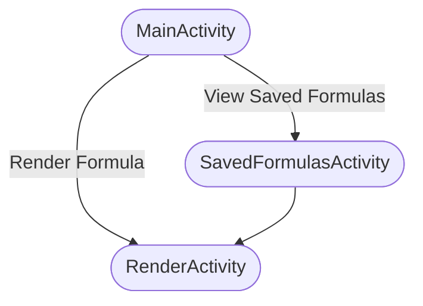
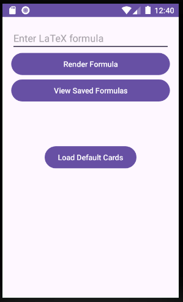
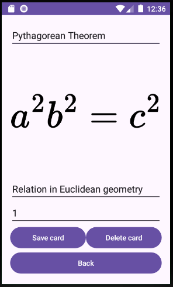

# Semestrální práce na předmět PAA

Aplikace vykresluje LaTeXové vzorce na základě zadaného vstupu, umožňuje také uživateli ukládat starší dotazy a zobrazovat je.

Aplikace ve stylu Flashcards, kde uživatel zadá vzorec a aplikace mu ho vykreslí. Uživatel si může vzorec uložit a zobrazit si ho později.

Aplikace jse sestavená a otestovaná na virtuálním stroji **Nexus S API 26**.

## Pro užiatele

Tři aktivity aplikace:
- MainActivity.kt - hlavní aktivita aplikace
- RenderActivity.kt - aktivita pro vykreslení vzorců
- SavedFormulasActivity.kt - aktivita pro zobrazení uložených vzorců



### Hlavní aktitivita



### Karta se vzorcem


## Jak funguje aplikace?

Aplikace ukládá vzorce do souborů v interní paměti zařízení. Na každý vzorec se vytvoří:
- jeden `.json` soubor, který obsahuje název vzorce a jeho latex zápis, 
- jeden `.svg` soubor s vyrenderovaným matematickým zápisem.

Do `.json` souboru se serializuje následující struktura:

```Kotlin
data class EquationData(
    val equation: String,
    val label: String,
    val description: String,
    val scale: Int,
    val svgFileName: String,
    val thisFileName: String,
)
```

### Vykreslení vzorců
Při prvním zobrazení karty se vygeneruje `.svg` soubor, který se následně zobrazí. Při opětovném zobrazení karty se již pouze načte vygenerovaný `.svg` soubor.

LaTeXové vzorce se vykreslují pomocí webu: [math.vercel.app](https://math.vercel.app/)

Například: 
